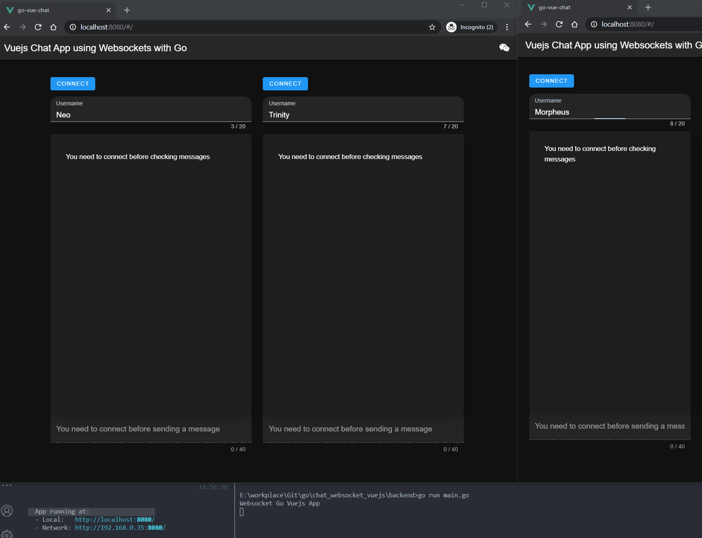

# Go & Vuejs Websocket Chat

This simple websocket chat app was developed using Go and Vuejs.

It allows users to connect to a Pool and chat with each other.



## How to

### Frontend

```bash
cd frontend
```

Install packages

```bash
yarn install
```

Or

```bash
npm install
```

### Test

```bash
yarn run serve
```

Or

```bash
npm run serve
```

### Backend

```bash
cd backend
go run main.go
```

## Websocket

On Go I am using [Gorilla Websocket](https://github.com/gorilla/websocket) and on Vuejs I am using [Vue Native Websocket](https://www.npmjs.com/package/vue-native-websocket) alongside [Vuex](https://vuex.vuejs.org/) (for the store).
